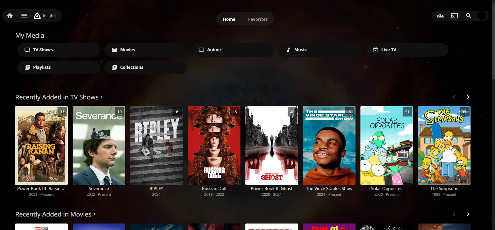
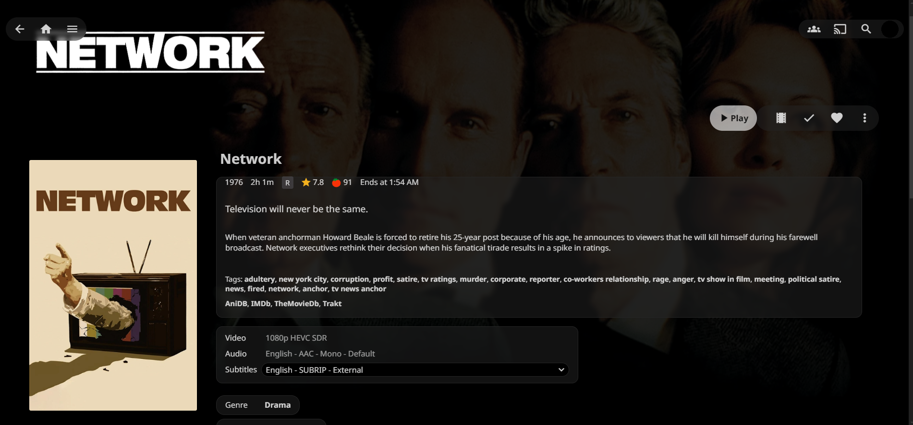
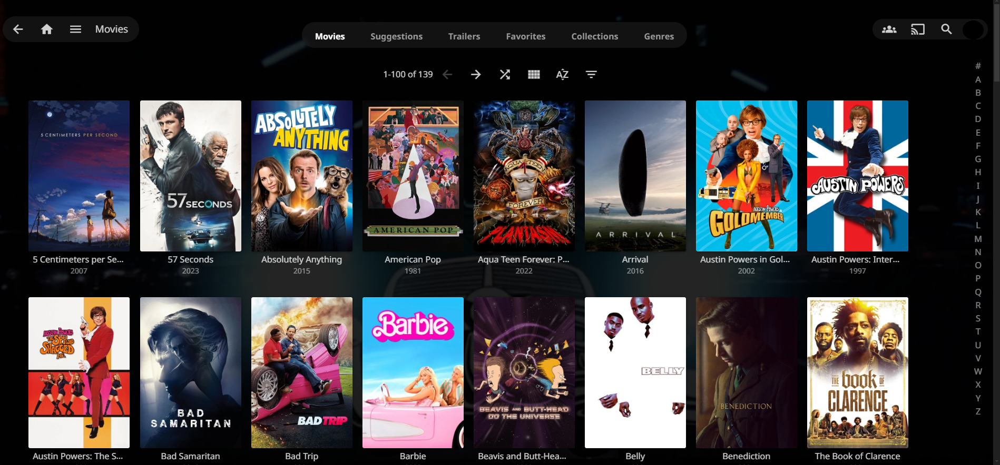
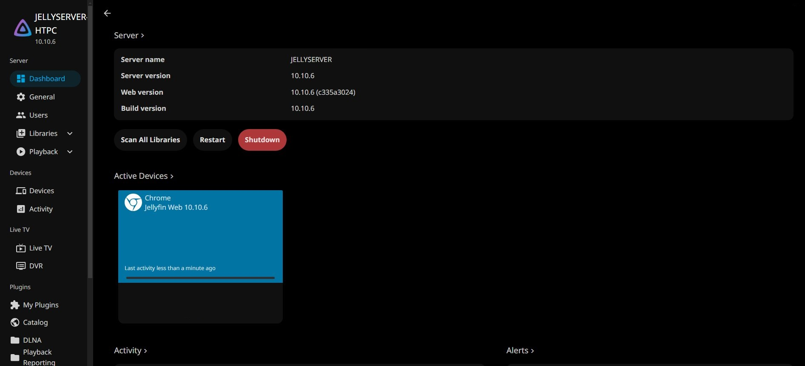

### **Modified version of Scyfin for Jellyfin WebUI**

[Go to installation](#installation)

Also avaliable as a [Userstyle](https://userstyles.world/style/21514/scyfin-oled-modified)

---

### **Scyfin Base Theme**

### Base Theme
`@import url('https://cdn.jsdelivr.net/gh/LitCastVlog/scyfin-mod@latest/CSS/scyfin-theme.css');`

### Scyfin-mod (Add this below the Options)
`@import url('https://cdn.jsdelivr.net/gh/LitCastVlog/scyfin-mod@latest/CSS/scyfin-mod.css');`

### Options (Add these below the base theme)
- Disable static left drawer 
    - `@import url('https://cdn.jsdelivr.net/gh/LitCastVlog/scyfin-mod@latest/CSS/disable-static-drawer.css');`
- Themes:
    - Seafoam
        - `@import url('https://cdn.jsdelivr.net/gh/LitCastVlog/scyfin-mod@latest/CSS/theme-seafoam.css');`
        - 
    - Coral
        - `@import url('https://cdn.jsdelivr.net/gh/LitCastVlog/scyfin-mod@latest/CSS/theme-coral.css');`
        - 
    - Snow
        - `@import url('https://cdn.jsdelivr.net/gh/LitCastVlog/scyfin-mod@latest/CSS/theme-snow.css');`
        - 
    - OLED
        - `@import url('https://cdn.jsdelivr.net/gh/LitCastVlog/scyfin-mod@latest/CSS/theme-oled.css');`
        - 
        - 

---

### **Installation:**

---
### Easy install (one liner) 
`@import url('https://cdn.jsdelivr.net/gh/LitCastVlog/scyfin-mod@latest/CSS/scyfin-mod-oneliner.css');`

*if the logo is too big (iOS, Android), append this as well* 
* `.pageTitleWithDefaultLogo {
    background-image: url("https://cdn2.steamgriddb.com/logo/3f44f3018ff71ff4a7d22a98f3babb55.png");
    background-size: 50%; /* Adjusted to make it 10% smaller */ }` 

**Server-wide install:**
* Click the hamburger icon (Top left)
* Navigate to "Dashboard" (If you don't see this, make sure you are signed in to your admin account)
* Navigate to "General"
* Near the bottom, under "Custom CSS code", paste the `@import url` for the base Scyfin theme
    * Example:
    * 
* Optional - Paste the `@import url` for any options / themes you may want
    * Example:
    * 
* Click "Save"

---

**Single client install:**
* Click the hamburger icon (Top left)
* Navigate to "Settings"
* Navigate to "Display"
* Near the middle, under "Custom CSS code", paste the `@import url` for the base Scyfin theme
    * Note - 
        * If there is any server-wide custom CSS, you may want to enable "Disable server-provided custom CSS code", as the two themes WILL interfere with each other
    * Example:
    * 
* Optional - Paste the `@import url` for any options / themes you may want
    * Example:
    * 
* Click "Save"
